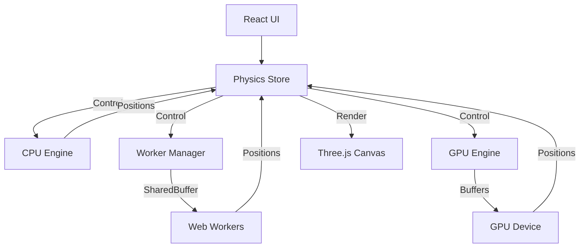

# Orbit Simulator Architecture V2

**Version**: 0.3.0
**Date**: 2025-12-28

## 1. System Overview

Orbit Simulator v0.3.0 introduces a **Hybrid Physics Engine** capable of dynamic switching between CPU (Single-threaded), Web Worker (Multi-threaded), and WebGPU (Massive Parallelism) modes. This architecture ensures optimal performance across a wide range of devices and simulation scales (from 10 to 20,000+ bodies).

## 2. Core Modules

### 2.1 Physics Store (`src/store/physicsStore.ts`)
The central hub using `zustand`. It manages:
- **State**: Bodies list, simulation status, time scale.
- **Engine Selection**: lazy-loads `PhysicsWorkerManager` or `GPUPhysicsEngine` on demand.
- **Synchronization**: Coordinates data transfer between the active engine and the UI (React/Three.js).
- **Energy Monitoring**: Throttled (1Hz) tracking of system energy to verify integration stability (Velocity Verlet).

### 2.2 Physics Engine Modes

#### A. CPU Mode (Default)
- **File**: `src/utils/physics.ts`
- **Algorithm**: Direct N-Body (O(N^2)) / Barnes-Hut (O(N log N))
- **Optimization**: Structure of Arrays (SoA) for cache locality.
- **Use Case**: Small N (< 500), Debugging, Non-SharedArrayBuffer environments.

#### B. Worker Mode (Multi-threading)
- **Manager**: `src/workers/physicsWorkerManager.ts` (Singleton/Lazy)
- **Worker**: `src/workers/physics.worker.ts`
- **Communication**: `SharedArrayBuffer` (Zero-copy).
- **Synchronization**: `Atomics.wait` / `Atomics.notify` barrier synchronization.
- **Use Case**: Medium N (500 - 5,000) on multi-core CPUs. Offloads main thread for smooth UI.

#### C. GPU Mode (WebGPU)
- **Engine**: `src/gpu/GPUPhysicsEngine.ts` (Singleton/Lazy)
- **Shader**: `nbody.wgsl` (Compute Shader)
- **Algorithm**: Shared Memory Tiled N-Body (O(N^2)).
- **Integration**: Velocity Verlet (2-Pass Compute).
- **Use Case**: Large N (5,000 - 20,000+).
- **Data Flow**: CPU → GPU (Init) → GPU Step (xN) → GPU Readback (for Rendering).

### 2.3 Constants & Configuration
- **File**: `src/constants/physics.ts`
- Centralized physics constants (`G`, `SOFTENING`), time steps (`BASE_DT`), and buffer limits (`MAX_BODIES`).

## 3. Data Flow

## 4. Key Optimizations

1.  **Lazy Initialization**: Heavy engines (Worker/GPU) are only instantiated when first toggled, reducing initial page load time.
2.  **Structure of Arrays (SoA)**: `Float64Array(N*3)` used for Positions/Velocities instead of Array of Objects, improving SIMD/Cache usage.
3.  **Zero-Copy Synchronization**: SharedArrayBuffer prevents data cloning between Main thread and Workers.
4.  **Energy Monitoring**: Real-time drift calculation ensures simulation validity without impacting per-frame performance.
